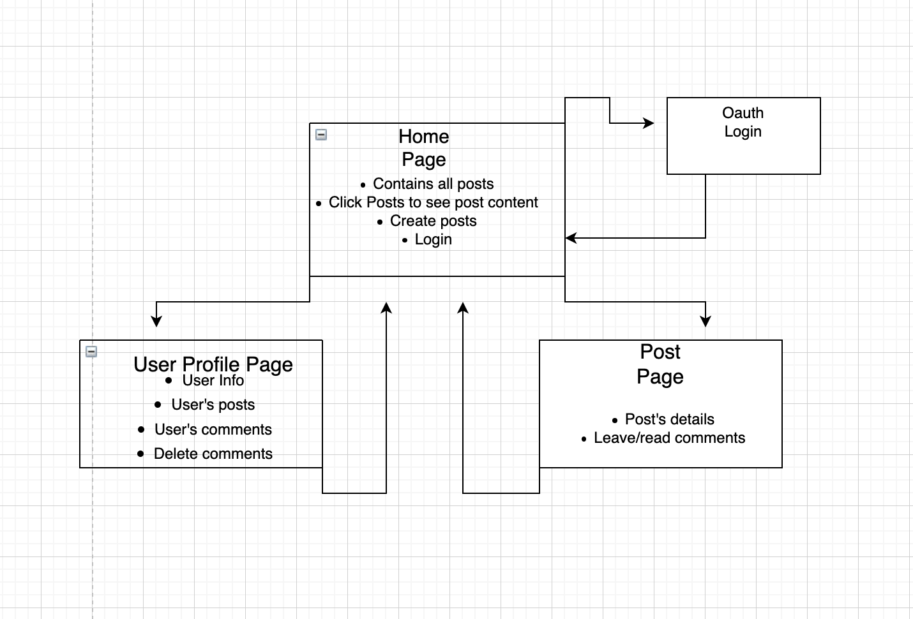

# Welcome to Fidget! The Side bar of the internet!
This is a place where everyone can share things and thoughts that they like!

In order to post you must have a google account, but if all you are here for is just browsing, feel free to browse away!

## Wireframes:

## Technologies Used:
Javascript, CSS, and EJS

## Chalenges:

EJS!!! Using OAUTH and having the user stay logged in was chellenging but the fix was so simple!

# CRUD functionality for posts. 

Create routes to each in routes/ 

Then create createPost.ejs? to use in post testing

(I can't access DB, don't know how, without ejs interface. Ask Nicole!)
Nicole says plug URI into Mongo Atlas. Alternatively, finish the ejs files!=======

